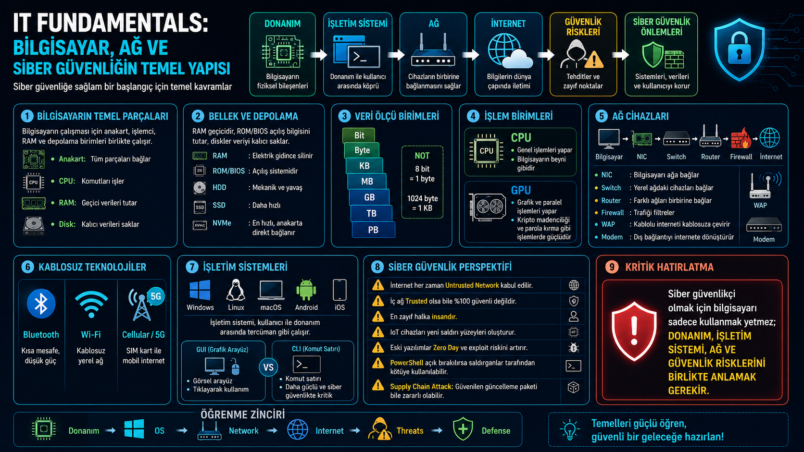
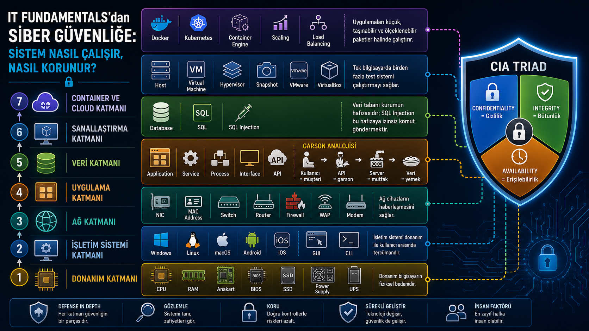

# 📘 01 — IT Fundamentals

<div align="center">


> **OakAcademy 13. Batch Siber Güvenlik Mühendisliği — Modül 1 ders notları.**  
> Siber güvenliğin teknik zeminini oluşturan IT temellerini kapsar.

</div>

---

## 📊 Modül Performansı

| Ölçüt | Sonuç | Durum |
|-------|-------|-------|
| Modül Sınavı | **92 / 100** | ✅ |
| TryHackMe — Careers in Cyber | **%100** | ✅ |
| TryHackMe — Security Awareness | **%100** | ✅ |

---

## 🗺️ Öğrenme Yol Haritası

> IT Fundamentals → Network Fundamentals → Operating Systems → Cybersecurity Basics → Security Tools & Labs → Career / Certifications


---

## 📁 Klasör Yapısı

```
01-IT-FUNDAMENTALS/
│
├── README.md
├── assets/
│   ├── 1-yol-haritasi.png
│   ├── 2-it-fundamentals.png
│   ├── 3-ag-guvenligi.png
│   ├── 4-donanim-temelleri.png
│   └── 5-siber-mimari.png
│
└── notes/
    ├── 1-IT_Fundementals-09_12_2025.md
    ├── 2-IT_Fundamentals-10_12_2025.md
    ├── 3-IT_Fundamentals-11_12_2025.md
    ├── 4-IT_Fundamentals-12_12_2025.md
    └── 5-IT_Fundamentals-15_12_2025.md
```

---

## 📚 Kapsanan Konular

### 🔐 Siber Güvenlik Temelleri

**Temel Kavramlar**

| Kavram | Açıklama |
|--------|----------|
| Cyber / Cyberspace | Bilgisayar ve ağ bağlantılı dijital ortam |
| Cybersecurity | Dijital sistemleri, verileri ve bireyleri koruma disiplini |
| Information Security | Dijital + fiziksel her türlü bilginin korunması |

**CIA Triad — Siber Güvenliğin 3 Temel Direği**

| Prensip | Açıklama |
|---------|----------|
| **Confidentiality** (Gizlilik) | Bilgiye yalnızca yetkili kişilerin erişmesi |
| **Integrity** (Bütünlük) | Bilginin yetkisiz olarak değiştirilmemesi |
| **Availability** (Erişilebilirlik) | Yetkili kişilerin sisteme ihtiyaç anında erişebilmesi |

**Ek Güvenlik Prensipleri**

| Kavram | Açıklama |
|--------|----------|
| Authentication | Kullanıcı kimliğini doğrulama |
| MFA | Çok faktörlü kimlik doğrulama |
| IAM | Kimlik ve erişim yönetimi |
| Non-repudiation | Yapılan işlemin inkâr edilememesi |
| Zero Trust | Hiçbir kullanıcı veya cihaza otomatik güvenmeme |

---

### 💻 Bilgisayar Donanımı



**Temel Bileşenler**

| Bileşen | Açıklama |
|---------|----------|
| **CPU** | Merkezi işlem birimi — bilgisayarın beyni |
| **GPU** | Grafiksel işlemlere özel işlem birimi |
| **RAM** | Geçici bellek — elektrik kesilince veri silinir |
| **ROM / BIOS** | Kalıcı bellek — başlangıç yazılımı tutar |
| **Anakart** | Tüm bileşenleri birbirine bağlayan ana devre kartı |
| **Input Unit** | Veri girişini sağlayan birimler (klavye, fare, mikrofon...) |
| **Output Unit** | İşlenmiş sonucu dışarı veren birimler (ekran, yazıcı...) |

**Depolama Birimleri**

| Depolama | Kalıcı | Hız | Bağlantı |
|----------|--------|-----|---------|
| HDD | ✅ | Düşük | SATA kablo |
| SSD | ✅ | Orta/Yüksek | SATA kablo |
| NVMe SSD | ✅ | Çok Yüksek | M.2 slot (kablo yok) |
| RAM | ❌ | Çok Yüksek | Doğrudan anakart |
| USB / Flash | ✅ | Orta | USB port |
| NAS | ✅ | Ağ Hızı | Ethernet |
| SAN | ✅ | Çok Yüksek | Fiber Kanal |
| Cloud | ✅ | İnternet Hızı | İnternet |

---

### 🔢 Sayı Sistemleri ve Binary

| Sistem | Taban | Semboller | Kullanım |
|--------|-------|-----------|---------|
| Decimal | 10 | 0-9 | Günlük hayat |
| Binary | 2 | 0-1 | Bilgisayar temeli |
| Hexadecimal | 16 | 0-9, A-F | Bellek adresleri, MAC, renk kodları |

**Veri Birimleri**

```
1 Bit      → 0 veya 1
8 Bit      → 1 Byte
1024 Byte  → 1 Kilobyte (KB)
1024 KB    → 1 Megabyte (MB)
1024 MB    → 1 Gigabyte (GB)
1024 GB    → 1 Terabyte (TB)
```

> **ASCII:** Karakterleri sayısal değerlerle eşleyen standart. Örnek: `A = 65 (decimal) = 01000001 (binary)`

---

### 📁 Dosya Sistemleri

| Dosya Sistemi | Platform | Özellik |
|---------------|----------|---------|
| FAT16 / FAT32 | Windows (eski) | Eski USB/kart uyumluluğu |
| NTFS | Windows | İzinler, şifreleme, büyük dosya desteği |
| exFAT | Çapraz platform | USB/SD kart için ideal |
| EXT3 / EXT4 | Linux | Linux'un standart dosya sistemi |
| XFS | Linux | Yüksek performanslı, büyük veri |

---

### 📡 Ağ Bileşenleri ve Cihaz Güvenliği


| Cihaz | Görevi |
|-------|--------|
| NIC (Ethernet Kartı) | Bilgisayarın ağa bağlanmasını sağlar |
| Switch | Aynı ağdaki cihazları MAC adresiyle yönetir |
| Hub | Veriyi tüm portlara gönderir (eski, verimsiz) |
| Router | Farklı ağlar arasında yönlendirme yapar |
| Modem | İnternet servis sağlayıcısıyla bağlantı kurar |
| Firewall | Ağ trafiğini filtreler, yetkisiz erişimi engeller |
| WAP | Kablosuz erişim noktası |

> **Veri akış sırası:** `NIC → Switch → Router → Modem → Firewall → İnternet`

---

### 🌐 Kablosuz Teknolojiler ve IoT

| Teknoloji | Kapsam | Güvenlik Notu |
|-----------|--------|--------------|
| Bluetooth | ~10 metre | Bluejacking, Bluesnarfing riski |
| Wi-Fi | ~30-100 metre | WPA2/WPA3 şifreleme önemli |
| 4G / 5G | Geniş alan | IMSI catcher saldırıları |

**Mobil Cihaz Güvenliği**

| Risk | Açıklama |
|------|----------|
| Juice Jacking | Halka açık USB şarj üzerinden veri çalma |
| Jailbreaking (iOS) | Apple kısıtlamalarını kaldırma — güvenlik riskleri artar |
| Rooting (Android) | Android kök erişimi — zararlı yazılım riski artar |
| PIN Brute Force | Kısa / zayıf PIN saldırısı |

> **HATIRLA:** Tanımadığın USB belleği takmak ve halka açık USB şarj kullanmak aynı güvenlik riskini taşır.

---

### 🖥️ İşletim Sistemleri

| OS | Tür | Arayüz | Siber Güvenlikte Kullanım |
|----|-----|--------|--------------------------|
| Windows | Kapalı kaynak | GUI ağırlıklı | Hedef sistem analizi, AD, Event Logs |
| Linux | Açık kaynak | CLI ağırlıklı | Server, pentest araçları |
| Kali Linux | Açık kaynak | CLI/GUI | Penetration testing |
| macOS | Kapalı kaynak | GUI | Geliştirme ortamı |
| Android / iOS | Karma | GUI | Mobil güvenlik analizi |

| Tür | Açıklama | Örnek |
|-----|----------|-------|
| GUI | Grafik arayüz | Windows Masaüstü |
| CLI | Komut satırı | Linux Terminal, PowerShell |

> **Güvenlik Notu:** PowerShell çok güçlü bir araçtır. Saldırganlar tarafından Living off the Land saldırılarında sıkça kullanılır.

---

### 🧱 Sistem Mimarisi — 7 Katman



| # | Katman | İçerik |
|---|--------|--------|
| 1 | **Donanım** | CPU, RAM, Anakart, BIOS, SSD, UPS |
| 2 | **İşletim Sistemi** | Windows, Linux, macOS, GUI, CLI |
| 3 | **Ağ** | NIC, Switch, Router, Firewall, WAP, Modem |
| 4 | **Uygulama** | Application, Service, Process, API |
| 5 | **Veri** | Database, SQL — SQL Injection tehdidi |
| 6 | **Sanallaştırma** | VM, Hypervisor, VMware, VirtualBox, Snapshot |
| 7 | **Container/Cloud** | Docker, Kubernetes, Scaling, Load Balancing |

---

### 🧱 Sanallaştırma ve Konteyner


| Kavram | Açıklama | Kullanım |
|--------|----------|---------|
| Hypervisor | Sanal makineleri yöneten yazılım katmanı | VMware, VirtualBox, Hyper-V |
| VM (Sanal Makine) | İzole tam işletim sistemi ortamı | Lab, test, pentest |
| Snapshot | Sistemin anlık durum kaydı | Hızlı geri dönüş |
| Konteyner | OS'u paylaşan hafif izole ortam | Docker |
| Docker | Popüler konteyner platformu | Uygulama dağıtımı |

---

### 🔍 Güvenlik Araçları ve Kavramları

| Araç / Kavram | Açıklama |
|---------------|----------|
| Firewall | Ağ trafiğini kurallara göre filtreler |
| EDR | Uç nokta tespit ve müdahale sistemi |
| SIEM | Güvenlik olaylarını ve logları merkezi izler |
| SOC Analyst | SIEM üzerinden güvenlik olaylarını takip eder |
| CVE | Güvenlik açıklarına verilen standart kod numarası |
| Pentest | Yetkili sızma testi |

---

### 📌 Gerçek Dünya Örnekleri

| Olay | Konu | Öğrenilen |
|------|------|-----------|
| Stuxnet | Natanz nükleer tesisi / SCADA/PLC | ICS/OT sistemleri hedef alınabilir |
| Estonya 2007 | DDoS ile ülke altyapısı felç edildi | Kritik altyapı saldırıları |
| Edward Snowden | NSA/CIA — PRISM, XKeyscore | İç tehdit ve aşırı yetki riski |
| Adobe Veri Sızıntısı | Milyonlarca kullanıcı verisi | Veri güvenliği önemi |
| FireEye Saldırısı | Güvenlik firması saldırıya uğradı | Hiçbir sistem %100 güvenli değil |
| SolarWinds | Tedarik zinciri saldırısı | Güvenilen yazılım da tehdit olabilir |
| Lockheed Martin / F-35 | Askeri veri hırsızlığı | Siber casusluk / nation-state |

---

### 🏅 Sertifikalar ve Kariyer Yolları

| Sertifika / Platform | Alan |
|----------------------|------|
| CompTIA Security+ | Genel siber güvenlik temeli |
| CEH | Ethical hacking |
| Fortinet NSE | Ağ güvenliği |
| Splunk Enterprise Certified Admin | SIEM / Log analizi |
| IBM Sertifikaları | Güvenlik operasyonları |
| Cisco Sertifikaları | Ağ ve güvenlik |
| TryHackMe | Uygulamalı öğrenme platformu |
| Coursera | Çevrimiçi sertifika programları |

---

## 🗓️ Ders Takvimi

| Ders | Tarih | Ana Konu |
|------|-------|----------|
| IT Fundamentals-1 | 09.12.2025 | Cybersecurity Giriş, CIA Triad, Binary, Storage |
| IT Fundamentals-2 | 10.12.2025 | Standartlar (NIST/ISO), Dosya Sistemleri, Donanım |
| IT Fundamentals-3 | 11.12.2025 | CPU/GPU, BIOS, IoT, Mobil Güvenlik, Ağ Bileşenleri |
| IT Fundamentals-4 | 12.12.2025 | İşletim Sistemleri, GUI/CLI, Sanallaştırma, SolarWinds |
| IT Fundamentals-5 | 15.12.2025 | Ağ Güvenliği, Uygulama Katmanı, Docker, Konteyner |

---

## 🎯 TryHackMe Rooms

| Room | Tamamlama |
|------|-----------|
| Careers in Cyber | ✅ %100 |
| Security Awareness | ✅ %100 |

---

## 💡 Modülden Anahtar Çıkarımlar

> *"Siber güvenlikte bir sistemi korumak için önce o sistemi anlamak gerekir."*

1. **Donanımı anla** — CPU, RAM, Storage, Anakart olmadan güvenlik açığını anlayamazsın.
2. **Ağı anla** — Switch, Router, Firewall, NIC olmadan ağ trafiğini yorumlayamazsın.
3. **OS'u anla** — Windows, Linux, CLI/GUI olmadan log okuyamazsın.
4. **CIA Triad'ı içselleştir** — Her güvenlik kararı Gizlilik, Bütünlük, Erişilebilirlik üzerine kurulur.
5. **Gerçek olayları takip et** — Stuxnet, SolarWinds, Estonya gibi vakalar teorik bilgiyi anlam kazandırır.

---

<div align="center">

[](https://www.linkedin.com/in/ekremtunçkır)
[](https://tryhackme.com/p/BY-EKREM)
[](https://github.com/ekremtunckir35)

*[← Ana Repoya Dön](../README.md) | [Modül 2 — Network Fundamentals →](../02-Network-Fundamentals/README.md)*

</div>
